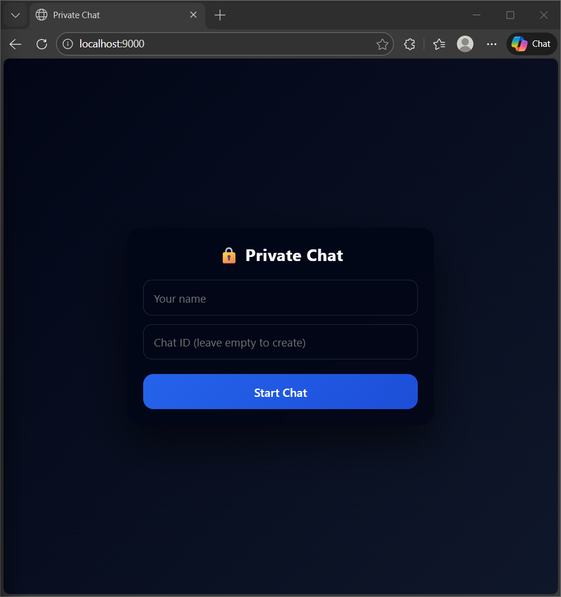
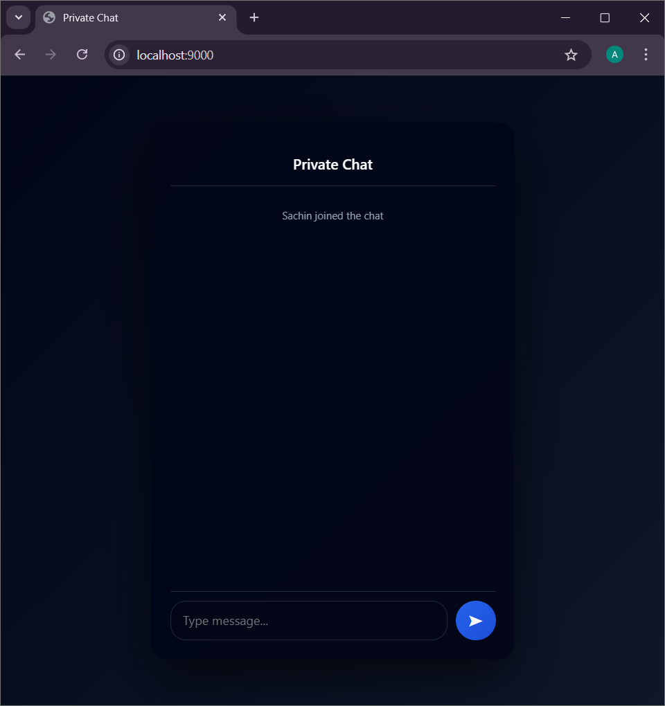

# 🔒 Private Real-Time Chat Application

A **private, real-time chat web application** built using **Node.js, Express, and Socket.IO**, focused on **temporary and privacy-friendly communication**.  
Users can create or join a private chat room using a unique Chat ID and communicate in real time with a clean and responsive UI.

---

## 🚀 Live Demo
🔗 https://your-render-link.onrender.com

## 💻 GitHub Repository
🔗 https://github.com/yourusername/your-repo

---

## ✨ Features

- 🔐 Create a **private chat room**
- 🆔 Auto-generated **unique Chat ID**
- 🔑 Join chat using an existing Chat ID
- ⚡ **Real-time messaging** using Socket.IO
- 🎨 Clean, modern & responsive UI
- 🧹 No permanent message storage (privacy-focused)
- 🌐 Deployed live on **Render (Free Tier)**

---

## 🛠️ Tech Stack

### Frontend
- HTML
- CSS
- JavaScript

### Backend
- Node.js
- Express.js
- Socket.IO

### Deployment
- Render

---

## ⚙️ How It Works

1. User enters their name
2. User can:
   - Create a new chat (Chat ID is generated)
   - OR join an existing chat using Chat ID
3. Both users are connected to the same private room
4. Messages are exchanged in real time
5. Typing indicator shows when the other user is typing

---

## 📂 Project Structure
```bash

chat-app/
├── public/
│ ├── index.html
│ ├── style.css
│ └── script.js
├── index.js
├── package.json
└── README.md
```
---

## ▶️ Run Locally

### 1️⃣ Clone the repository
```bash
git clone https://github.com/yourusername/your-repo.git

```

### 2️⃣ Navigate to the project folder

```bash
cd your-repo
```

### 3️⃣ Install dependencies
```bash
npm install
```

### 4️⃣ Start the server
```bash
npm start
```

### 5️⃣ Open in browser
```bash
http://localhost:9000
```

📸 Screenshots
###  🏠 Home Page
<p align="center">
  
</p>

### 🏠 Home Page

<p align="center">
  
</p>

### Singup
<p align="center">
  
</p>

## 📌 Future Improvements

#### ⏳ Auto-expire chat rooms

#### 🔐 OTP-based authentication

#### 🧾 Message encryption

#### 📱 PWA support (installable app)

#### 👥 Multi-user private rooms

## 👨‍💻 Author

### Aman Kumar Vishwakarma

B.Tech CSE Student
📍 India

GitHub: https://github.com/amankv1234/Private_chat

LinkedIn: https://www.linkedin.com/in/aman-kumar-vishwakarma-08b223304/

⭐ Support

If you like this project, please ⭐ star the repository
Feedback and contributions are welcome!